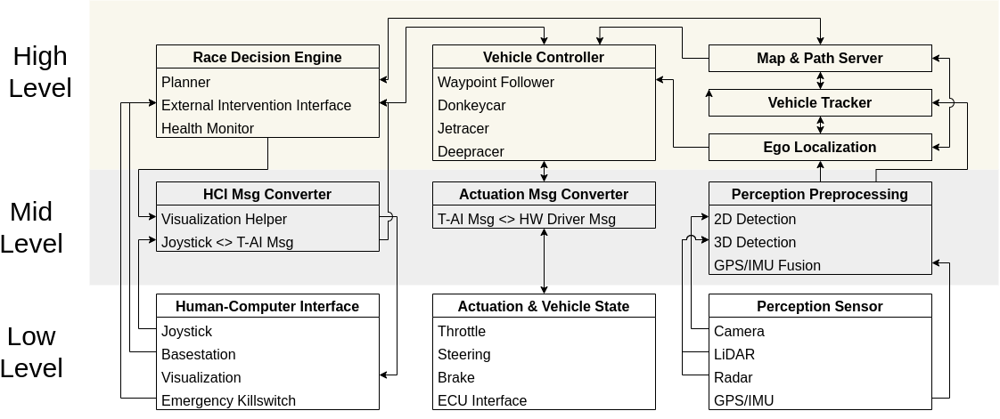

# Triton-AI-Racer-ROS2
Core repo for the unified Triton AI Racer platform for autonomous race vehicles in ROS2

## Getting Started

### Installation

- [Develop Triton AI Racer Packages on Host PC](doc/install_host_pc.md)
- [Deploy onto Edge Devices]()

### Education

- [Triton AI Racer Vehicle Interface Platform](doc/tai_platform_note.md)
- [Using Triton AI Racer for Your Project]()

### Racing

- [Deploy on DSC 190 robot](deploy/model_190/README.md)
- [Deploy on ECE/MAE 148 robot]()
- [Deploy on Donkeysim]()

## System Overview

