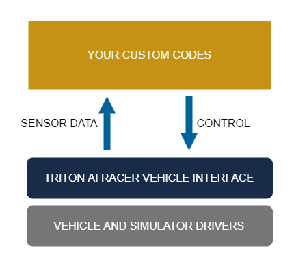

# Triton AI Racer Vehicle Interface Platform

## Accelerate Your Self-Driving Project

Triton AI Racer can serve as a vehicle interface platform for your project. It frees you from worrying about the low-level hardware and simulator drivers while keeping your focus on the high-level algorithms: perception, localization, planning, control, etc.

Your job is simplified into receiving sensor input from, and providing control outputs to the Triton AI Racer interface. Certain ground truth data is also available from the interface with simulators.

Currently the platform supports RC vehicles with a VESC controller ([F1/10](https://f1tenth.org/)-like), and Electric Go-kart in [EvGrandPrix](https://evgrandprix.org/) autonomous series. With simulators, the platform supports [DonkeySim](https://docs.donkeycar.com/guide/simulator/) and [LGSVL](https://www.svlsimulator.com/).

## Getting Started

For a technical documentation of what you need to do, please refer to [Using Triton AI Racer for Your Project](use_tai_racer_for_your_project.md).